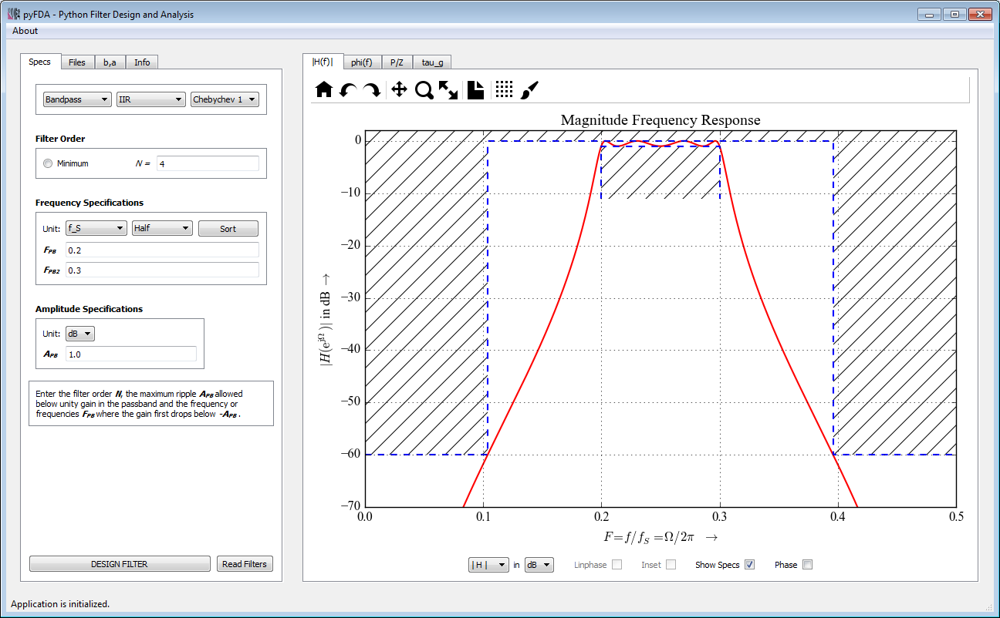

pyFDA
======
## Python Filter Design Analysis Tool

The goal of this project is to create a GUI based tool in Python / Qt to analyse and design discrete time filters. 

### Why yet another filter design tool?
* **Education:** There is a very limited choice of user-friendly, license-free tools available to teach the influence of different filter design methods and specifications on time and frequency behaviour.
* **Show-off:** Demonstrate that Python is a potent tool for digital signal processing applications as well. The interfaces for textual filter design routines are a nightmare: linear vs. logarithmic specs, frequencies normalized w.r.t. to sampling or Nyquist frequency, -3 dB vs. -6 dB vs. band-edge frequencies ... (This is due to the different backgrounds and the history of filter design algorithms and not Python-specific.)
* **Fixpoint filter design for uCs:** Recursive filters have become a niche for experts. Convenient design and simulation support (round-off noise, stability under different quantization options and topologies) could attract more designers to these filters that are easier on hardware resources and much more suitable e.g. for uCs.
* **Fixpoint filter design for FPGAs**: Especially on low-budget FPGAs, multipliers are rare. However, there are no good tools for designing and analyzing filters requiring a limited number of multipliers (or none at all) like CIC-, LDI- or Sigma-Delta based designs.
* **HDL filter implementation:** Implementing a fixpoint filter in VHDL / Verilog without errors requires some experience, verifying the correct performance in a digital design environment with very limited frequency domain simulation options is even harder. The Python module [myHDL](http://myhdl.org) can automate both design and verification.

### The following features are currently implemented:

* **Clearly structured GUI** - only widgets needed for the currently selected design method are visible
* **Common interface for all filter design methods:**
 * Currently implemented (scipy.signal): Equiripple, Firwin, Chebychev 1 and Chebychev 2 
 * use absolute frequencies or frequencies normalized to sampling or Nyquist frequency
 * specify ripple and attenuations in dB, as voltage or as power ratios
* **Switch between design methods**, keeping all other settings
 * Filter order and corner frequencies calculated by minimum order algorithms can be fine-tuned by hand
 * Directly compare how a set of specifications influences the resulting filter for different design methods
* **Graphical Analyses**
 * Magnitude response (lin / power / log) with optional display of the specification bands
 * Phase response (wrapped / unwrapped)
 * Group delay
 * Pole / Zero plot
* **Modular architecture**, facilitating the implementation of new filter design and analysis methods
 * Filter design files can be added and edited *without* changing or even restarting the program
 * Special widgets needed by design methods (e.g. for choosing the window in Firwin) are included in the filter design file, not in the main program
* **Filter coefficients and poles / zeros**
 * Display, edit and quantize 
 * Save as Comma-separated values (CSV) or Matlab (R) workspace format
* **Display help files** (own / Python docstrings) as rich text
* **Runs under Python 2.7 and Python 3.x**

### Release 0.1 (target: end of March 2015)

The following features are still missing for the first release. Help is very welcome!
* Filter design methods (some clean-up of the design method files' structure needed before implementing more methods)
 * Butterworth
 * Elliptic
* Graphical analyses (some updates to the plotting infrastructure needed)
 * Impulse response
 * 3D-Plots
* Save and load filter designs (pickle? shelve?)
* Load coefficients / poles and zeros
* Smooth some rough edges (more debugging, warnings, look and feel of GUI, ...)

### Following releases
* Better help files and messages
* Show error messages and warnings in the GUI
* Design, analysis and export of filters as second-order sections
* Multiplier-free filter designs (CIC, GCIC, LDI, SigmaDelta-Filters, ...)
* Export of Python filter objects
* Analysis of different fixpoint filter topologies (direct form, cascaded form, parallel form, ...) concerning overflow and quantization noise
* Fixpoint filter sythesis and export using the myHDL module (<http://myhdl.org>)

### Further ideas are
* Wave-Digital Filters
* ...

