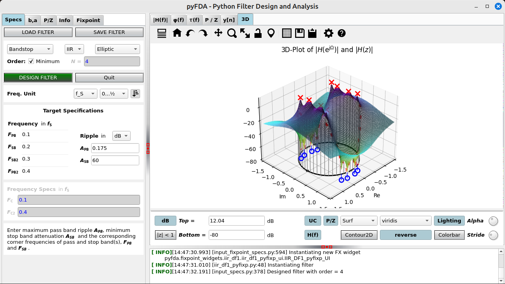
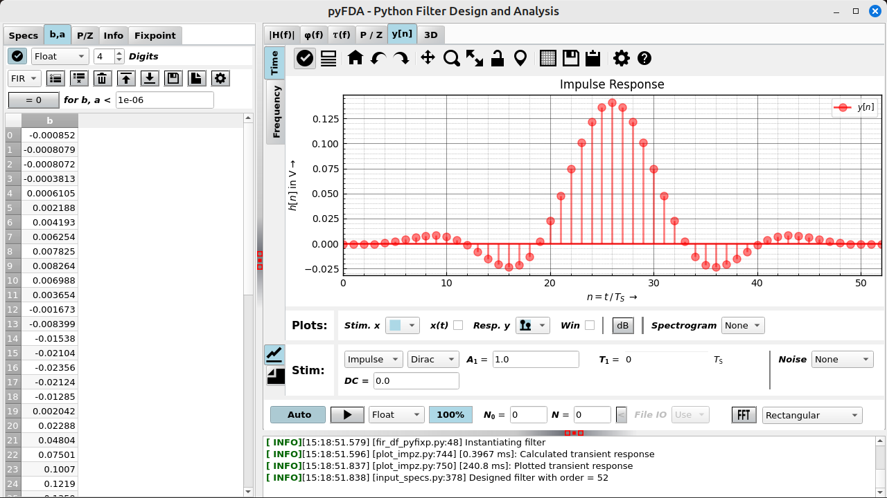

# pyfda

## Python Filter Design Analysis Tool

<!--  -->
<!--  -->

**pyfda** is a tool written in Python / Qt for analyzing and designing discrete time filters with a user-friendly GUI. Fixpoint filter implementations (for some filter types) can be simulated and tested for overflow and quantization behaviour in the time and frequency domain.

<table>
    <tr>
        <td></td>
        <td></td>
        <td></td>
   </tr>
    <tr>
        <td></td>
        <td></td>
        <td></td>
    </tr>
  <tr>
        <td></td> 
        <td></td> 
        <td></td> 
  <tr>
</table>

## License

pyfda source code ist distributed under a permissive MIT license, binaries / bundles come with a GPLv3 license due to bundled components with stricter licenses.

## Installing, running and uninstalling pyfda

For details, see [INSTALLATION.md](INSTALLATION.md).

### Binaries

Binaries can be downloaded under [Releases](https://github.com/chipmuenk/pyfda/releases) for versioned releases and for a latest release, automatically created for each push to the main branch.

Self-extracting archives for **64 bit Windows**, **OS X** and **Ubuntu Linux** are created with **[pyInstaller](https://www.pyinstaller.org/)**. The archives self-extract to a temporary directory that is automatically deleted when pyfda is terminated (except when it crashes), they don't modify the system except for two ASCII configuration files and a log file. No additional software / libraries need to be installed, there is no interaction with existing python installations and you can simply overwrite or delete the executables when updating. After downloading the Linux archive, you need to make it executable (`chmod 775 pyfda_linux`).

Binaries for **Linux** are created as Flatpaks as well **(currently defunct)** which can also be downloaded from **[Flathub](https://flathub.org/apps/details/com.github.chipmuenk.pyfda)**. Many Linux distros have built-in flatpak support, for others it's easy to install with e.g. `sudo apt install flatpak`. For details check the [Flatpak](https://www.flatpak.org/) home page.

### pip

**Python 3.8** and above is supported, there is only one version of pyfda for all operating systems at [PyPI](https://pypi.org/project/pyfda/). As pyfda is a pure Python project (no compilation required), you can install pyfda the usual way, required libraries are downloaded automatically if missing:

    > pip install pyfda

Upgrade:

    > pip install pyfda -U

Uninstall:

    > pip uninstall pyfda

<!--
If you have cloned `pyfda` to your local drive you can install the local copy (i.e. create local config files and the `pyfdax` starter script) via

    > pip install -e <YOUR_PATH_TO_PYFDA_setup.py>

-->

#### Starting pyfda

A pip installation creates a start script `pyfdax` in `<python>/Scripts` which should be in your path. So, simply start pyfda using

    > pyfdax

The following libraries are required and installed automatically by pip when missing.

- **[PyQt](https://www.riverbankcomputing.com/software/pyqt/)** and **[Qt5](https://qt.io/)**
- **[numpy](https://numpy.org/)**
- **[numexpr](https://github.com/pydata/numexpr)**
- **[scipy](https://scipy.org/)**: **1.2.0** or higher
- **[matplotlib](https://matplotlib.org/)**: **3.1** or higher
- **[Markdown](https://github.com/Python-Markdown/markdown)**
  
**Optional libraries:**

- **[mplcursors](https://mplcursors.readthedocs.io/)** for annotating cursors
- **[docutils](https://docutils.sourceforge.io)** for rich text in documentation
- **xlwt** and / or **XlsxWriter** for exporting filter coefficients as *.xls(x) files

### conda

If you're working with Anaconda's packet manager conda, there is a recipe for pyfda on `conda-forge` since July 2023:

    > conda install --channel=conda-forge pyfda

You should install pyfda into a new environment to avoid unwanted interaction with other installations.

### git

If you want to contribute to pyfda (great idea!), fork the latest version from [https://github.com/chipmuenk/pyfda.git](https://github.com/chipmuenk/pyfda.git) and create a local copy using

    > git clone https://github.com/<your_username>pyfda

This command creates a new folder `pyfda` at your current directory level and copies the complete pyfda project into it. This [Github tutorial](https://docs.github.com/en/get-started/quickstart/fork-a-repo) provides a good starting point for working with git repos.

pyfda can then be installed (i.e. creating local config files and the `pyfdax` starter script) from local files using

    > pip install -e <YOUR_PATH_TO_PYFDA_setup.py>

Now you can edit the code and test it. If you're happy with it, push it to your repo and create a Pull Request so that the code can be reviewed and merged into the `chipmuenk/pyfda` repo.

## Building pyfda

For details on how to publish pyfda to PyPI, how to create pyInstaller and Flatpak bundles, see [BUILDING.md](BUILDING.md).

## Customization

The location of the following two configuration files (copied to user space) can be checked via the tab `Files -> About`:

- Logging verbosity can be controlled via the file `pyfda_log.conf` 
- Widgets and filters can be enabled / disabled via the file `pyfda.conf`. You can also define one or more user directories containing your own widgets and / or filters.

Layout and some default paths can be customized using the file `pyfda/pyfda_rc.py`, at the moment you have to edit that file at its original location.

## Features

### Filter design

- **Design methods**: Equiripple, Firwin, Moving Average, Bessel, Butterworth, Elliptic, Chebyshev 1 and 2 (from scipy.signal and custom methods)
- **Second-Order Sections** are used in the filter design when available for more robust filter design and analysis
- **Fine-tune** manually the filter order and corner frequencies calculated by minimum order algorithms
- **Compare filter designs** for a given set of specifications and different design methods
- **Filter coefficients and poles / zeroes** can be displayed, edited and quantized in various formats
- **Fixpoint filters** based on the integrated `Fixed()` class or on the 
[Amaranth](https://amaranth-lang.org/docs/amaranth/latest/intro.html) hardware description
language.

### User Interface

- enhanced Matplotlib NavigationToolbar (nicer icons, additional functions)
- tooltips for all UI widgets and help files
- specify frequencies as absolute values or normalized to sampling or Nyquist frequency
- specify ripple and attenuations in dB, as voltage or as power ratios
- enter values as expressions like `exp(-pi/4 * 1j)` using [numexpr](https://github.com/pydata/numexpr) syntax

### Graphical Analyses

- Magnitude response (lin / power / log) with optional display of specification bands, phase and an inset plot
- Phase response (wrapped / unwrapped) and group delay
- Pole / Zero plot
- Transient response (impulse, step and various stimulus signals) in the time and frequency domain. Define your own stimuli like `abs(sin(2*pi*n*f1))` using [numexpr](https://github.com/pydata/numexpr) syntax and the UI.
- 3D-Plots (H\|(f)\|, mesh, surface, contour) with optional pole / zero display

### Import / Export

- Filter designs in JSON, pickled and in numpy's NPZ-format
- Coefficients and poles/zeros as comma-separated values (CSV), in CMSIS format in numpy's NPY- and NPZ-formats, in Excel (R), as a Matlab (R) workspace or in FPGA vendor specific formats like Xilinx (R) COE-format
- Transient stimuli (y[n] tab) as wav and csv files

## Target group

- **Educators and students:** Provide an easy-to-use FOSS tool for demonstrating DSP stuff and interactive filter design that also works with the limited resolution of a beamer.
- **Fixpoint filter designer:** Recursive fixpoint filter design has become a niche for experts. Convenient design and simulation support (round-off noise, stability under different quantization options and topologies) could attract more designers to these filters that are easier on hardware resources and much more suitable especially for uCs and low-budget FPGAs.

## Release History

For details, see [CHANGELOG.md](./CHANGELOG.md).

## Planned features (help wanted)

- Dark mode
- Use [Amaranth](https://amaranth-lang.org/docs/amaranth/latest/intro.html) to simulate fixpoint filters and export them in HDL format
- Graphical modification of poles / zeros
- Document filter designs in PDF / HTML format
- Design, analysis and export of filters as second-order sections, display and edit them in the P/Z widget
- Multiplier-free filter designs (CIC, GCIC, LDI, &Sigma;&Delta;, ...) for fixpoint filters with a low number of multipliers (or none at all)
- Analysis of different fixpoint filter topologies (direct form, cascaded form, parallel form, ...) concerning overflow and quantization noise
