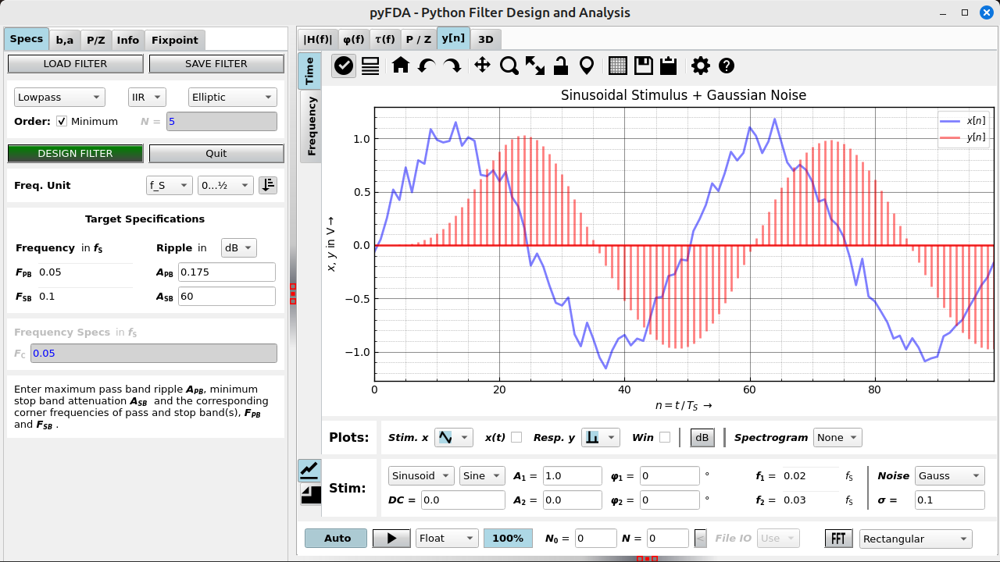
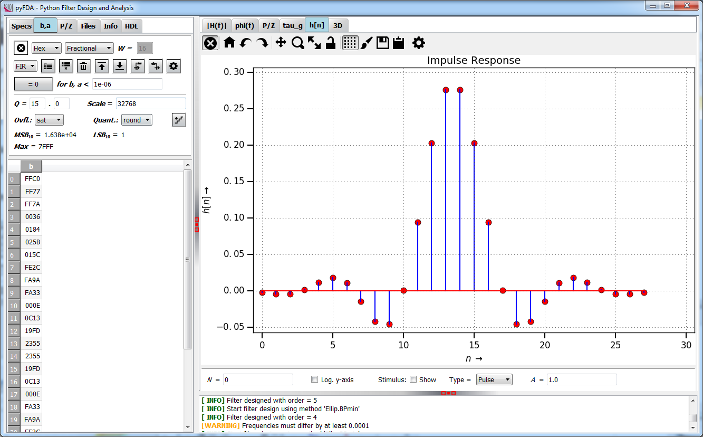
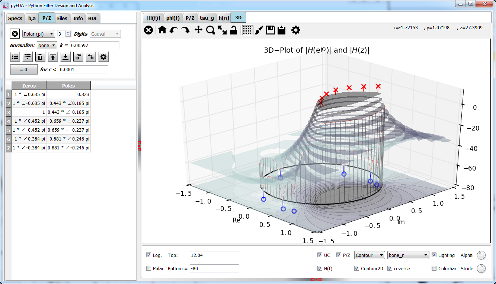
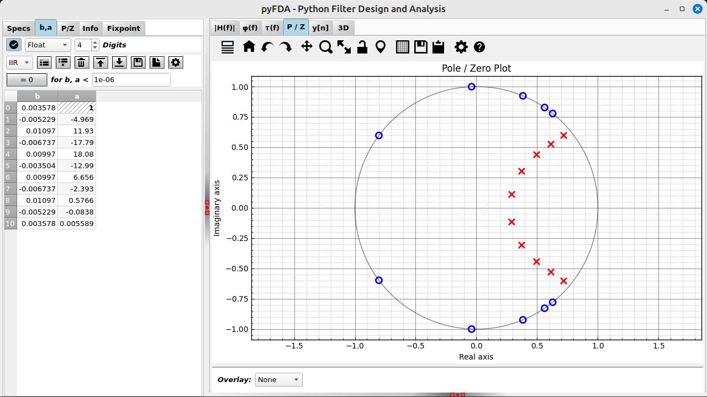
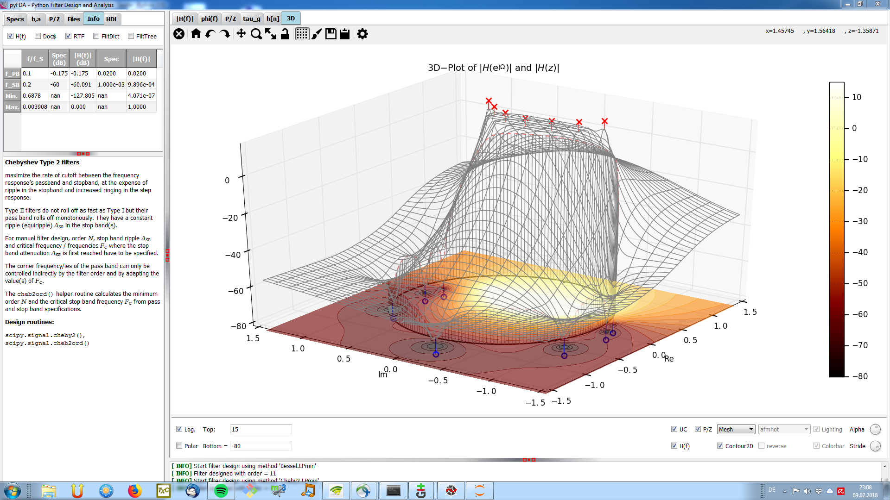
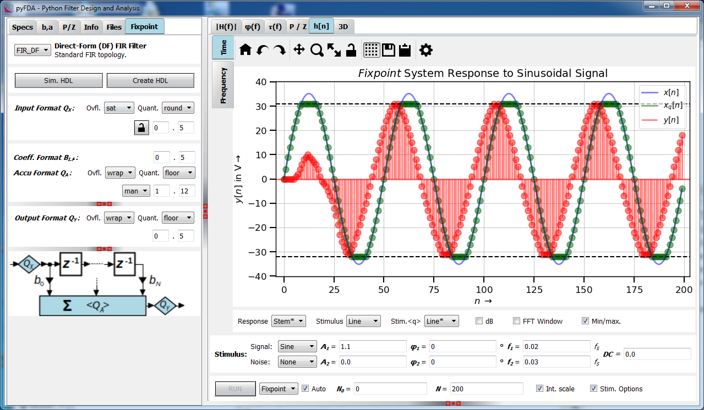
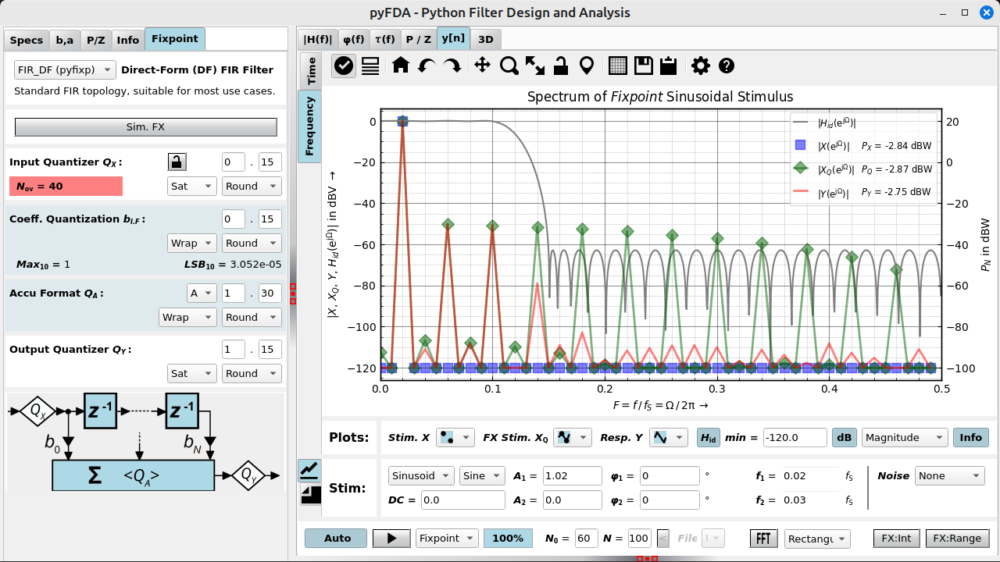

pyfda
======
## Python Filter Design Analysis Tool

**pyfda** is tool written in Python / Qt for analysing and designing discrete time filters with a user-friendly GUI. Fixpoint filter implementations (for some filter types) can be simulated and tested for overflow and quantization behaviour in the time and frequency domain.

<table>
    <tr>
        <td></td>
        <td></td>
        <td></td>
   </tr>
    <tr>
        <td></td>
        <td></td>
        <td></td>
    </tr>
  <tr>
        <td></td> 
        <td></td> 
        <td></td> 
  <tr>
</table>

## License
pyfda source code ist distributed under a permissive MIT license, binaries / bundles come with a GPLv3 license due to bundled components with stricter licenses.

## Binaries / Bundles
Currently, binaries (created with **[pyInstaller](https://www.pyinstaller.org/))** are provided for 64 bit Win 7 ... 10 and for 64 bit Ubuntu (created with 2020.04). The binaries may or may not work with other systems, too. The binaries don't modify the system (except for two ASCII configuration files and a log file), they self-extract to a temporary directory that is automatically deleted when pyfda is terminated (except when it crashes). No additionaly software / libraries need to be installed. For details, see [INSTALLATION.md](INSTALLATION.md).

A flatpak (Linux only) for pyfda is available on **[Flathub](https://flathub.org/apps/details/com.github.chipmuenk.pyfda)**. Some Linux distros have built-in flatpak support, for others it's easy to install with e.g. `sudo apt install flatpak`. For details check the [Flatpak](https://www.flatpak.org/) home page.

Help needed for generation of a MacOS binary! 

## Prerequisites

* Python versions: **3.7 ... 3.10**
* All operating systems - there should be no OS specific requirements.
### Libraries ###
The following libraries are required and automatically installed by pip when missing.
* [**PyQt**](https://www.riverbankcomputing.com/software/pyqt/) and [**Qt5**](https://qt.io/)
* [**numpy**](https://numpy.org/)
* [**numexpr**](https://github.com/pydata/numexpr)
* [**scipy**](https://scipy.org/): **1.2.0** or higher
* [**matplotlib**](https://matplotlib.org/): **3.1** or higher
* [**Markdown**](https://github.com/Python-Markdown/markdown)
  
### Optional libraries:
* [**mplcursors**](https://mplcursors.readthedocs.io/) for annotating cursors
* [**docutils**](https://docutils.sourceforge.io) for rich text in documentation
* **xlwt** and / or **XlsxWriter** for exporting filter coefficients as *.xls(x) files

## Installing pyfda
Unless running a binary, you need to have a working Python installation on your computer, preferrably including the libraries listed above. 

There is only one version of pyfda for all supported operating systems, Python and Qt versions. As pyfda is a pure Python project (no binaries, no compilation required), you can install pyfda using one of the following options: 
### pip
Installation from PyPI works the usual way, required libraries are installed automatically if missing:

    > pip3 install pyfda

Upgrade using

    > pip3 install pyfda -U
    
If you have cloned `pyfda` to your local drive you can install the local copy (i.e. create local config files and the `pyfdax` starter script) via

    > pip3 install -e <YOUR_PATH_TO_PYFDA_setup.py>

For more details and options see [INSTALLATION.md](INSTALLATION.md).

### setup.py   
You can also download the zip file and extract it to a temp directory of your choice. Install it either to your `<python>/Lib/site-packages` subdirectory (this creates a copy) using

    > python setup.py install

or just create a link to where you have copied the python source files (for testing / development) using

    > python setup.py develop

### git
For development purposes, you should fork the latest version of pyfda from https://github.com/chipmuenk/pyfda.git and create a local copy using

	> git clone https://github.com/<your pyfda fork>

This command creates a new folder "pyfda" at your current directory level and copies the complete pyfda project into it.

The tutorial at https://help.github.com/en/articles/fork-a-repo provides a good starting point for working with git repos. As described above, pyfda can then be 
installed from local files using either 

    > pip3 install -e <YOUR_PATH_TO_PYFDA_setup.py>
    
 or
 
    > python setup.py develop

Now you can edit the code and test it. If you're happy with it, push it to your repo and create a Pull Request so that the code can be reviewed and merged into the `chipmuenk/pyfda` repo.

## Starting pyfda
In any case, a start script `pyfdax` should have been created in `<python>/Scripts` which should be in your path. So, simply start pyfda using

    > pyfdax
   
### Customization

The location of the following two configuration files (copied to user space) can be checked via the tab `Files -> About`:

* Logging verbosity can be controlled via the file `pyfda_log.conf` 
* Widgets and filters can be enabled / disabled via the file `pyfda.conf`. You can also define one or more user directories containing your own widgets and / or filters.

Layout and some default paths can be customized using the file `pyfda/pyfda_rc.py`, at the moment you have to edit that file at its original location.

## Features
### Filter design ###
* **Design methods**: Equiripple, Firwin, Moving Average, Bessel, Butterworth, Elliptic, Chebyshev 1 and 2 (from scipy.signal and custom methods)
* **Second-Order Sections** are used in the filter design when available for more robust filter design and analysis
* **Fine-tune** manually the filter order and corner frequencies calculated by minimum order algorithms
* **Compare filter designs** for a given set of specifications and different design methods
* **Filter coefficients and poles / zeroes** can be displayed, edited and quantized in various formats

### User Interface ###
* only widgets needed for the currently selected design method are visible
* specifications are remembered when switching between filter design methods
* enhanced matplotlib NavigationToolbar (nicer icons, additional functions)
* tooltips for all UI widgets and help files
* specify frequencies as absolute values or normalized to sampling or Nyquist frequency
* specify ripple and attenuations in dB, as voltage or as power ratios
* enter expressions like exp(-pi/4 * 1j) (using the numexpr module)

### Graphical Analyses ###
* Magnitude response (lin / power / log) with optional display of specification bands, phase and an inset plot
* Phase response (wrapped / unwrapped) and group delay
* Pole / Zero plot
* Transient response (impulse, step and various stimulus signals) in the time and frequency domain. Roll your own stimuli (courtesy of [numexpr](https://github.com/pydata/numexpr) module)!
* 3D-Plots (|H(f)|, mesh, surface, contour) with optional pole / zero display
### Modular Architecture ###
facilitates the implementation of new filter design and analysis methods. Generate your own
* Filter design files, containing the actual algorithm and optional GUI widgets
* Plotting widgets
* Input widgets
* Fixpoint filter widgets, using the integrated `Fixed()` class 

### Import / Export ###
* Export and import filter designs in pickled and in numpy's NPZ-format
* Export and import coefficients and poles/zeros as comma-separated values (CSV), in numpy's NPY- and NPZ-formats, in Excel (R), as a Matlab (R) workspace or in FPGA vendor specific formats like Xilinx (R) COE-format

## Why yet another filter design tool?
* **Education:** Provide an easy-to-use FOSS tool for demonstrating basic digital stuff and filter design interactively that also works with the limited resolution of a beamer.
* **Show-off:** Demonstrate that Python is a potent tool for digital signal processing as well.
* **Fixpoint filter design:** Recursive fixpoint filter design has become a niche for experts. Convenient design and simulation support (round-off noise, stability under different quantization options and topologies) could attract more designers to these filters that are easier on hardware resources and much more suitable especially for uCs and low-budget FPGAs.

## Release History / Roadmap

For details, see [CHANGELOG.md](./CHANGELOG.md).

### Planned features 

#### Started
* Dark mode
* HDL filter implementation: Implementing a fixpoint filter in VHDL / Verilog without errors requires some experience, verifying the correct performance in a digital design environment with very limited frequency domain simulation options is even harder.

#### Ideas (for the not so near future or for )
* Use audio files as stimuli in the impz widget and store results. Maybe real-time for FIR filters?
* Keep multiple designs in memory, switch between them, compare results and store the whole set
* Graphical modification of poles / zeros
* Document filter designs in PDF / HTML format
* Design, analysis and export of filters as second-order sections, display and edit them in the P/Z widget
* Multiplier-free filter designs (CIC, GCIC, LDI, SigmaDelta-Filters, ...) for fixpoint filters with a low number of multipliers (or none at all)
* Export of Python filter objects
* Analysis of different fixpoint filter topologies (direct form, cascaded form, parallel form, ...) concerning overflow and quantization noise
