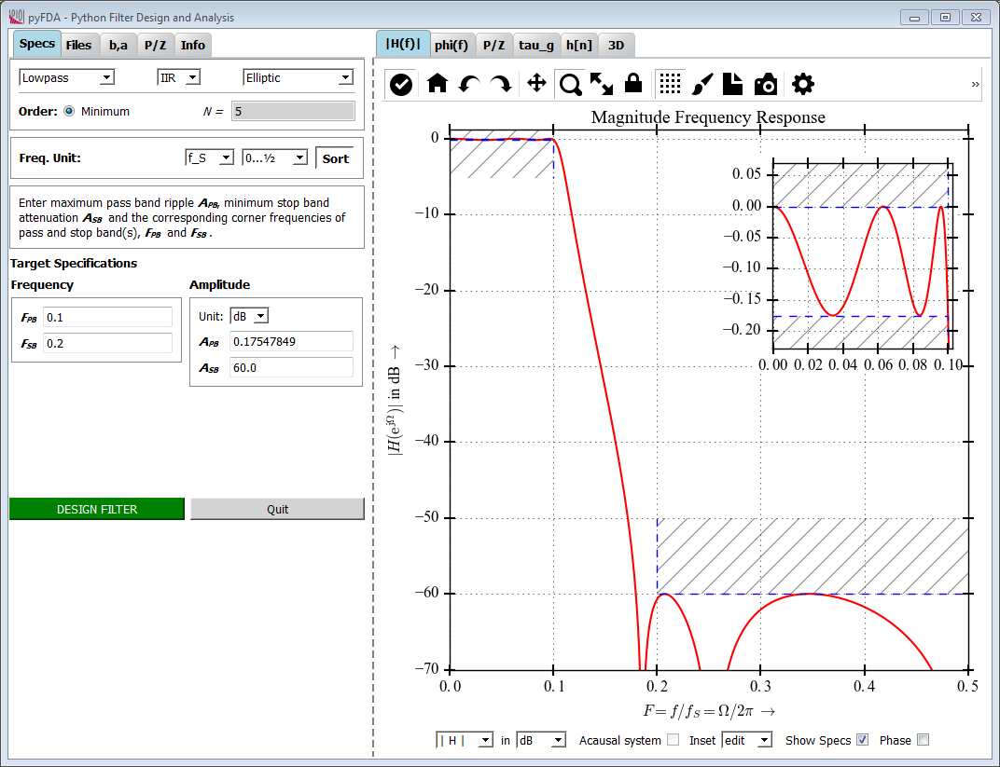
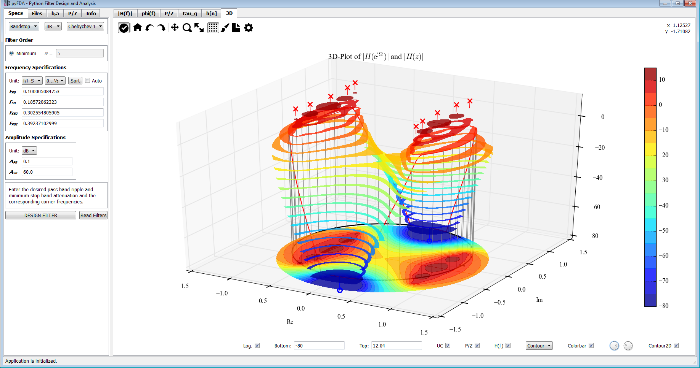
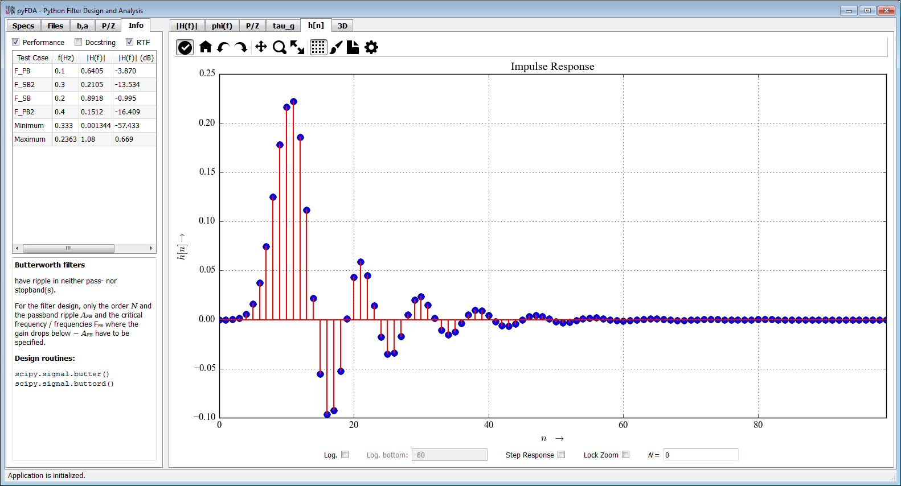
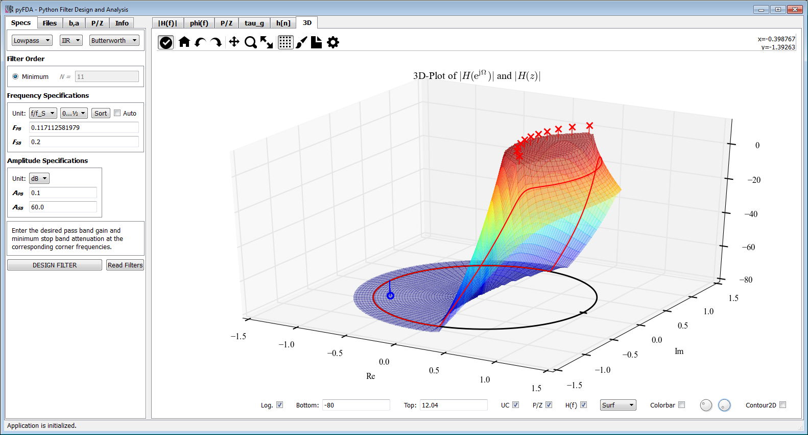
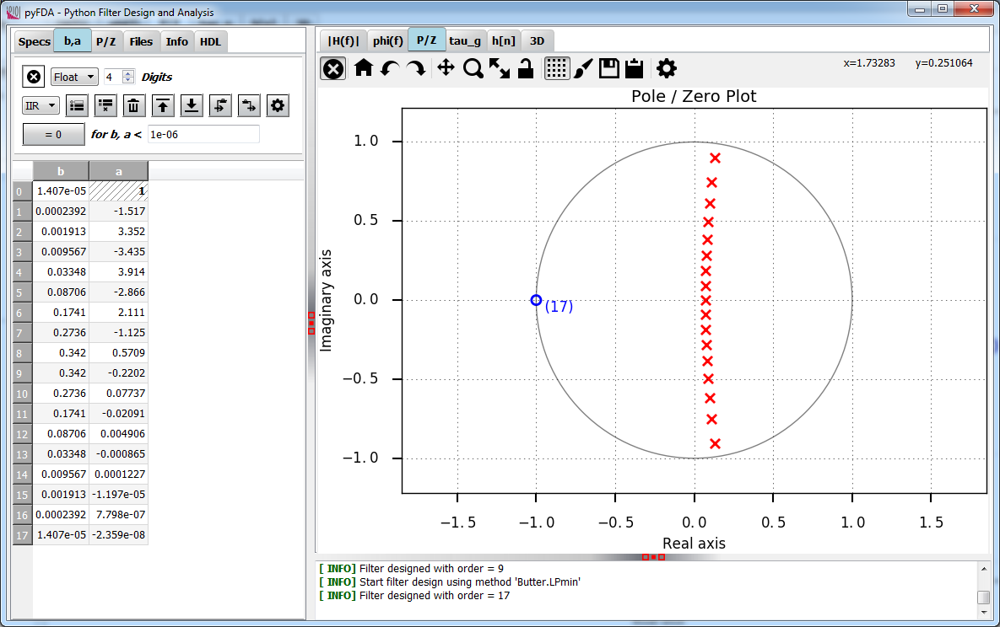

pyFDA
======
## Python Filter Design Analysis Tool

pyFDA is a GUI based tool in Python / Qt for analysing and designing discrete time filters. The capability for generating Verilog and VHDL code for the designed and quantized filters will be added in the next release.

**Screenshot from the current version:**

### Prerequisites
* Python versions: **2.7** or **3.3 ... 3.5**
* All operating systems - there should be no OS specific requirements.
* Libraries:
  * **(Py)Qt4** or **(Py)Qt5**. When both libraries are installed, PyQt5 is used.
  * **numpy**
  * **scipy**
  * **matplotlib**

Optional libraries:
* **docutils** for rich text in documentation
* **xlwt** and / or **XlsxWriter** for exporting filter coefficients as *.xls(x) files

### Installing pyFDA
There is only one version of pyfda for all supported operating systems, Python and Qt versions. As there are no binaries included, you can simply install from the source.

#### pip
This is the most convenient way:

    pip install pyfda

#### conda
If you use the Anaconda distribution, you can install pyfda from my Anaconda channel `Chipmuenk` using

    conda install --channel https://conda.anaconda.org/Chipmuenk pyfda

Unfortunately, Anaconda insists on providing OS- and Python-specific versions for `pyfda`. I'm working on that, help is appreciated ...

#### setup.py
    
Download the zip file and extract it to a directory of your choice. Install it either to your `<python>/Lib/site-packages` subdirectory using

    >> python setup.py install

or just create a link to where you have copied the python source files (for testing / development) using

    >> python setup.py develop

### Starting pyFDA
In any case, the start script `pyfdax` has been created in `<python>/Scripts` which should be in your path. So, simply start pyfda using

    >> pyfdax

For development and debugging, you can also run pyFDA using

    In [1]: %run -m pyfda.pyfdax :# IPython or
    >> python -m pyfda.pyfdax    # plain python interpreter
    
All individual files from pyFDA can be run using e.g.

    In [2]: %run -m pyfda.input_widgets.input_pz    # IPython or 
    >> python -m pyfda.input_widgets.input_pz  # plain python interpreter
   
### Customization

The layout and some default paths can be customized using the file `pyfda/pyfda_rc.py`.

### Why yet another filter design tool?
* **Education:** There is a very limited choice of user-friendly, license-free tools available to teach the influence of different filter design methods and specifications on time and frequency behaviour. It should be possible to run the tool without severe limitations also with the limited resolution of a beamer.
* **Show-off:** Demonstrate that Python is a potent tool for digital signal processing applications as well. The interfaces for textual filter design routines are a nightmare: linear vs. logarithmic specs, frequencies normalized w.r.t. to sampling or Nyquist frequency, -3 dB vs. -6 dB vs. band-edge frequencies ... (This is due to the different backgrounds and the history of filter design algorithms and not Python-specific.)
* **Fixpoint filter design for uCs:** Recursive filters have become a niche for experts. Convenient design and simulation support (round-off noise, stability under different quantization options and topologies) could attract more designers to these filters that are easier on hardware resources and much more suitable e.g. for uCs.
* **Fixpoint filter design for FPGAs**: Especially on low-budget FPGAs, multipliers are expensive. However, there are no good tools for designing and analyzing filters requiring a limited number of multipliers (or none at all) like CIC-, LDI- or Sigma-Delta based designs.
* **HDL filter implementation:** Implementing a fixpoint filter in VHDL / Verilog without errors requires some experience, verifying the correct performance in a digital design environment with very limited frequency domain simulation options is even harder. The Python module [myHDL](http://myhdl.org) can automate both design and verification.

### The following features are currently implemented:

* **Filter design**
    * **Design methods** from scipy.signal: Equiripple, Firwin, Movine Average, Bessel, Butterworth, Elliptic, Chebychev 1 and Chebychev 2
    * **Second-Order Sections** are used in the filter design when available for more robust filter design and analysis
    * **Remember all specifications** when changing filter design methods
    * **Fine-tune** manually the filter order and corner frequencies calculated by minimum order algorithms
    * **Compare filter designs** for a given set of specifications and different design methods
    * **Filter coefficients and poles / zeroes** can be displayed, edited and quantized
* **Clearly structured GUI**
 * only widgets needed for the currently selected design method are visible
 * enhanced matplotlib NavigationToolbar (nicer icons, additional functions)
* **Common interface for all filter design methods:**
 * specify frequencies as absolute values or normalized to sampling or Nyquist frequency
 * specify ripple and attenuations in dB, as voltage or as power ratios
 * enter expressions like exp(-pi/4 * 1j) with the help of the library [simpleeval](https://pypi.python.org/pypi/simpleeval) (included in source files)
* **Graphical Analyses**
 * Magnitude response (lin / power / log) with optional display of specification bands, phase and an inset plot
 * Phase response (wrapped / unwrapped)
 * Group delay
 * Pole / Zero plot
 * Impulse response and step response (lin / log)
 * 3D-Plots (|H(f)|, mesh, surface, contour) with optional pole / zero display
* **Modular architecture**, facilitating the implementation of new filter design and analysis methods
 * Filter design files not only contain the actual algorithm but also dictionaries specifying which parameters and standard widgets have to be displayed in the GUI. 
 * Special widgets needed by design methods (e.g. for choosing the window type in Firwin) are included in the filter design file, not in the main program
* **Saving and loading**
 * Save and load filter designs in pickled and in numpy's NPZ-format
 * Export coefficients and poles/zeros as comma-separated values (CSV), in numpy's NPZ-format, in Excel (R) or in Matlab (R) workspace format
* **Display help files** (own / Python docstrings) as rich text 

**More screenshots from the current version:**
<table>
    <tr>
        <td></td>
        <td></td>        
   </tr>
    <tr>
        <td></td>
        <td></td>
    </tr>
</table>

### Release 0.1

The following features are still missing for the first release. 
* Not all filter specifications are handled properly (issues #36 and #40), this is addressed currently and will be fixed in 0.1rc4
* Scrolling and resizing of widgets has some flaws creating problems with small screens

### Release 0.2
* **myHDL support**
    * Export of VHDL / Verilog netlists for basic filter topologies
    * Fixpoint simulation results in pyFDA widgets
* **Filter coefficients and poles / zeros**
  * Display coefficients / poles and zeros with fewer digits while keeping full precision internally
  * Group multiple poles / zeros (SOS)
  * Load coefficients / poles and zeros in various formats 
* **Filter Manager**
  * Store multiple designs in one filter dict
  * Compare multiple designs in plots
* **Documentation using Sphinx**

### Following releases
* Better help files and messages
* Add a tracking cursor
* Graphical modification of poles / zeros
* Export of filter properties as PDF / HTML files
* Show error messages and warnings in the GUI
* Design, analysis and export of filters as second-order sections
* Multiplier-free filter designs (CIC, GCIC, LDI, SigmaDelta-Filters, ...)
* Export of Python filter objects
* Analysis of different fixpoint filter topologies (direct form, cascaded form, parallel form, ...) concerning overflow and quantization noise

### Further ideas are
* Wave-Digital Filters
* test filters in real-time with a audio stream
* ...

