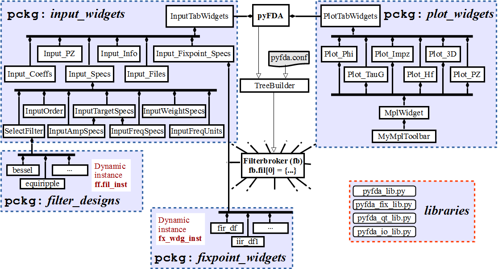

Software Organization
----------------------

The software is organized as shown in the following figure

   pyfda Organization

**Communication:**
    The modules communicate via Qt's signal-slot mechanism (see: :ref:`dev_signalling`).

**Data Persistence:**
    Common data is stored in dicts that can be accessed globally (see: :ref:`dev_persistence`).

**Customization:**
    The software can be customized a.o. via the file ``conf.py`` (see: :ref:`man_customization`).

.. _dev_signalling:

Signalling: What's up?
----------------------

The figure above shows the general pyfda hierarchy. When parameters or settings are
changed in a widget, a Qt signal is emitted that can be processed by other widgets
with a ``sig_rx`` slot for receiving information. The dict ``dict_sig`` is attached
to the signal as a "payload", providing information about the sender and the type
of event . ``sig_rx`` is connected to the
``process_sig_rx()`` method that processes the dict.

Many Qt signals can be connected to one Qt slot and one signal to many slots,
so signals of input and plot widgets are collected in
:mod:`pyfda.input_widgets.input_tab_widgets`
and :mod:`pyfda.plot_widgets.plot_tab_widgets` respectively and connected collectively.

When a redraw / calculations can take a long time, it makes sense to perform these
operations only when the widget is visible and store the need for a redraw in a flag.

.. code::

    class MyWidget(QWidget):
        sig_resize = pyqtSignal()   # emit a local signal upon resize
        sig_rx = pyqtSignal(object) # incoming signal
        sig_tx = pyqtSignal(object) # outgoing signal
        from pyfda.libs.pyfda_qt_lib import emit

        def __init__(self, parent):
            super(MyWidget, self).__init__(parent)
            self.data_changed = True # initialize flags
            self.view_changed = True
            self.filt_changed = True
            self.sig_rx.connect(self.process_sig_rx)
            # usually done in method ``_construct_UI()``

        def process_sig_rx(self, dict_sig=None):
        """
        Process signals coming in via subwidgets and sig_rx
        """
        if dict_sig['id'] == id(self):
            logger.warning("Stopped infinite loop:\n{0}".format(pprint_log(dict_sig)))
            return
        if self.isVisible():
            if 'data_changed' in dict_sig or self.data_changed:
                self.recalculate_some_data() # this may take time ...
                self.data_changed = False
            if 'view_changed' in dict_sig and dict_sig['view_changed'] == 'new_limits'\
                or self.view_changed:
                self._update_my_plot()       # ... while this just updates the display
                self.view_changed = False
            if 'filt_changed' in dict_sig or self.filt_changed:
                self.update_wdg_UI()         # new filter needs new UI options
                self.filt_changed = False
        else:
            if 'data_changed' in dict_sig or 'view_changed' in dict_sig:
                self.data_changed = True
                self.view_changed = True
            if 'filt_changed' in dict_sig:
                self.filt_changed = True

Data can be transmitted via the global ``sig_tx`` signal (referenced by the imported
``emit()`` method):

.. code::

    dict_sig = {'fx_sim':'update_data', 'fx_results':some_new_data}
    self.emit(dict_sig)

The following dictionary keys are generally used, individual ones can be created
as needed.

:'id': Python ``id(self)`` reference to the sending widget instance, needed a.o.
    to prevent infinite loops which may occur when the rx event is connected to
    the tx signal. **Automatically added by ``emit()`` if not in ``dict_sig``.**

:'class': Class name of the sending widget, usually given as ``self.__class__.__name__``.
    This can be used for debugging purposes.
    **Automatically added by ``emit()`` if not in ``dict_sig``.**

:'ttl': Optional, defines the "time-to-live". The integer value given at definition is
    decreased every time ``emit()`` is called. When zero is reached, the signal is
    terminated.

:'filt_changed': A different filter type (response type, algorithm, ...) has been
    selected or loaded, requiring an update of the UI in some widgets.

:'data_changed': A filter has been designed and the actual data (e.g. coefficients)
    has changed, you can add the (short) name or a data description as the dict value.
    When this key is sent, most widgets have to be updated.

:'specs_changed': Filter specifications have changed - this will influence only
    a few widgets like the :ref:`dev_plot_hf` widget that plots the filter specifications
    as an overlay or the :ref:`dev_input_info` widget that compares filter performance
    to filter specifications.

:'view_changed': When e.g. the range of the frequency axis is changed from
    :math:`0 \ldots f_S/2` to :math:`-f_S/2 \ldots f_S/2`, this information can
    be propagated with the ``'view_changed'`` key.

:'ui_local_changed': Propagate a change of the UI to the containing widget but not
    to other widgets, examples are:
    - ``'ui_local_changed': self.sender().objectName()'`` to propagate the name of
    the emitting subwidget

:'ui_global_changed': Propagate a change of the UI to other widgets, examples are:

     - ``'ui_global_changed':'csv'`` for a change of CSV import / export options

     - ``'ui_global_changed':'resize'`` when the parent window has been resized

     - ``'ui_global_changed':'tab'`` when a different tab has been selected

:'fx_sim': Signal the phase / status of a fixpoint simulation ('finished', 'error')

.. _dev_persistence:

Persistence: Where's the data?
------------------------------

At startup, a dictionary is constructed with information about the filter
classes and their methods. The central dictionary ``fb.dict`` is initialized.

