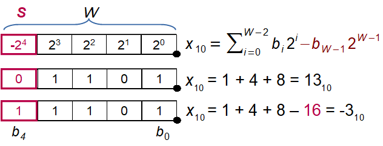
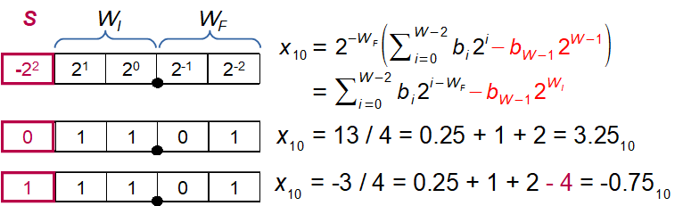
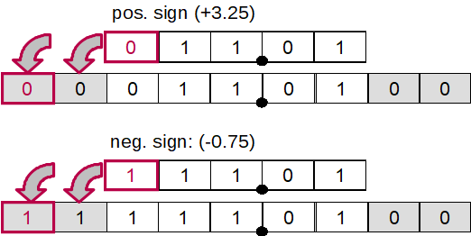
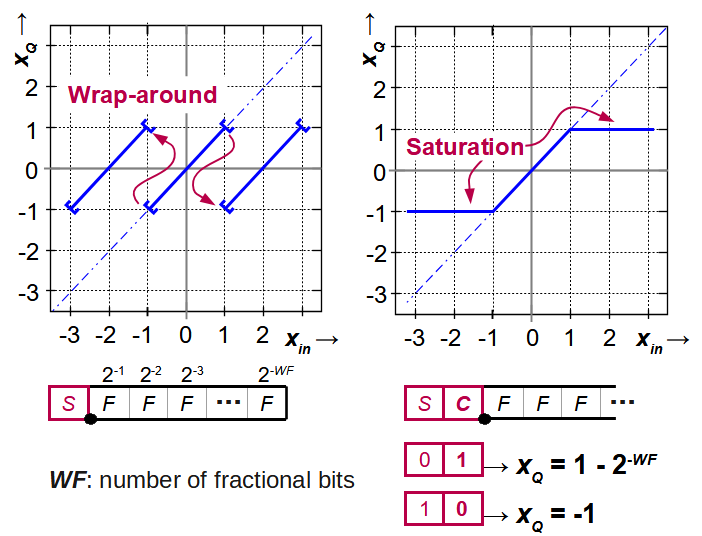
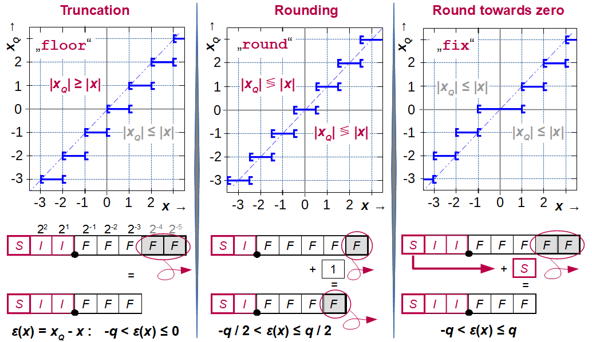

.. _man_fixpoint_arithmetics:

####################
Fixpoint Arithmetics
####################

Overview
---------

In contrast to floating point numbers, **fixpoint** numbers have a fixed scaling,
requiring more care to avoid over- or underflows. The same binary word can
represent an integer (:numref:`fig_twos_complement_int`) or a fractional
(:numref:`fig_twos_complement_frac`) number, signed or unsigned. The position of the
binary point and whether the MSB represents the sign bit or not, it is all in the
designer's head ...

.. _fig_twos_complement_int:

   Signed integer number in twos-complement format

.. _fig_twos_complement_frac:

   Signed fractional number in twos-complement format

The fixpoint format of input word :math:`Q_X` and output word
:math:`Q_Y` can be adjusted for all fixpoint filters, pressing the "lock" button
makes the format of input and output word identical. Depending on the fixpoint
filter, other formats (coefficients, accumulator) can be set as well.

In general, **Ovfl.** combo boxes determine overflow behaviour (Two's complement
wrap around or saturation), **Quant.** combo boxes select quantization behaviour
between rounding, truncation ("floor") or round-towards-zero ("fix"). These methods
may not all be implemented for each fixpoint filter. Truncation is easiest to
implement but has an average bias of -1/2 LSB, in contrast, rounding has no bias
but requires an additional adder. Only rounding-towards-zero guarantees that the
magnitude of the rounded number is not larger than the input, thus preventing
limit cycles in recursive filters.

Typical simulation results are shown in :numref:`fig_pyfda_screenshot_yn_overflows`,
where first the input signal exceeds the numeric range and then the output signal.
The overflow behaviour is set to 'wrap', resulting in twos-complement wrap around
with changes in the sign.

.. _fig_pyfda_screenshot_yn_overflows:

.. figure:: ../screenshots/pyfda_screenshot_fix_yn_t.png
   :alt: Screenshot of fixpoint simulation results (time domain)
   :width: 80%
   :align: center

   Fixpoint filter response with overflows

Sign extension
***************

When increasing the number of integer bits, numbers need to be sign extended,
i.e. the new leading bits need to be filled with the sign bit
(:numref:`fig_sign_extension`). Extending the
number of fractional bits just requires zero padding.

.. _fig_sign_extension:

   Sign extension of integer and fractional numbers

Overflow behaviour
*******************

After summation or when reducing the number of integer bits, the result may
not fit in the numeric range.

Discarding one or more leading bits to obtain the desired wordlength is easy but may produce
wrap-arounds. The resulting sign changes can introduce instability and limit-cycle
oscillations to the system (:numref:`fig_fixpoint_overflow`, left-hand side).

Saturation (:numref:`fig_fixpoint_overflow`, right-hand side) is much more benign
but requires a little more effort: Before adding two numbers,
both need to be sign extended by one bit to enable overflow detection. As shown in
:numref:`fig_fixpoint_overflow`, when the two leading bits (sign and carry) are `01`
or `10`, the result exceeds the numeric range and needs to be replaced by the maximum
resp. minimum representable value. When reducing the number of integer bits, similar
checks need to be performed to test for overflows.

.. _fig_fixpoint_overflow:

   Overflow behaviour with wrap-around or saturation

Truncation and rounding
**************************

.. _fig_requant_reduce_fractional:

   Reducing fractional word length using truncation, rounding and round-towards-zero

The following shows an example of a positive number in Q2.4 that is converted to Q1.3
format using truncation. It's easy to see that for simple wrap-around
logic, the sign of the result may change.

::

  S | WI1 | WI0 . WF0 | WF1 | WF2 | WF3  :  WI = 2, WF = 4, W = 7
  0 |  1  |  0  .  1  |  0  |  1  |  1   =  43 (QINT) or 43/16 = 2 + 11/16 (QFRAC)
                |
                v
       S  | WI0 . WF0 | WF1 | WF2        :  WI = 1, WF = 3, W = 5
       1     0  .  1  |  0  |  1         = -32 + 21 = -11 (subtract -2Ŵ for sign bit)
                                         = -16 + 5  = -11 (sign bit as -2^(W -1) )
                                         or -2 + 5/8 = -11 / 8

Summation
*********

Before adding two fixpoint numbers with a different number of integer and/or
fractional bits, integer and fractional word lenghts need to equalized:

- the fractional parts are padded with zeros
- the integer parts need to be sign extended, i.e. with zeros for positive
  numbers and with ones for negative numbers
- adding numbers can require additional integer places due to word growth

For this reason, the position of the binary point needs to be respected when
summing fixpoint numbers.

::

  S | WI1 | WI0 . WF0 | WF1 | WF2 | WF3  :  WI = 2, WF = 4, W = 7
  0 |  1  |  0  .  1  |  0  |  1  |  1   =  43 (INT) or 43/16 = 2 + 11/16 (RWV)

                +

  S | WI1 | WI0 . WF0 | WF1 | WF2 | WF3  :  WI = 2, WF = 4, W = 7
  0 |  0  |  0  .  1  |  0  |  1  |  0   =  10 (INT) or 10/16 (RWV)

                =

  S | WI1 | WI0 . WF0 | WF1 | WF2 | WF3  :  WI = 2, WF = 4, W = 7
  0 |  1  |  1  .  0  |  1  |  0  |  1   =  53 (INT) or 53/16 = 3 + 5/16 (RWV)

Products
*********