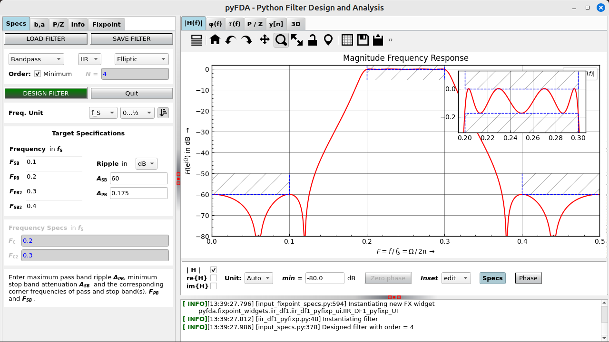

User Manual
===========

.. _fig_pyfda_screenshot:

   Screenshot of pyfda

:numref:`fig_pyfda_screenshot` shows the main pyfda screen with three subwindows 
that can be resized with the handles (red dots):

   .. toctree::
      :maxdepth: 1
      :caption: Subwindow for Input Widgets

      input_specs
      input_coeffs
      input_pz
      input_info
      input_fixpoint_specs

   The tabs on the left-hand side access widgets to enter and view various
   specification and parameters for the filter / system to be designed resp. analyzed.

   .. toctree::
      :maxdepth: 1
      :caption: Subwindow for Plotting Widgets

      plot_hf
      plot_phi
      plot_tau_g
      plot_pz
      plot_impz
      plot_3d

   The subwidgets on the right-hand side allow for graphical analyses of the system.

Logger Subwindow
----------------

The logging window in the lower part of the plotting window can be resized
or completely closed. Its content can be selected, copied
or cleared with a right mouse button context menu.

.. _man_customization:

Customization
--------------
You can customize pyfda behaviour in some configuration files:

pyfda.conf
~~~~~~~~~~~~~

A copy of ``pyfda/pyfda.conf`` is created in ``<USER_HOME>/.pyfda/pyfda.conf``
where it can be edited by the user to choose which widgets and filters will be included.
Fixpoint widgets can be assigned to filter designs and one or more user directories can
be defined if you want to develop and integrate your own widgets (it's not so hard!):

.. include:: pyfda_conf.rst

pyfda_log.conf
~~~~~~~~~~~~~~~

A copy of ``pyfda/pyfda_log.conf`` is created in ``<USER_HOME>/.pyfda/pyfda_log.conf``
where it can be edited to control logging behaviour:

.. include:: pyfda_conf_log.rst

pyfda_rc.py
~~~~~~~~~~~~~~~

Layout and some parameters can be customized with the file
``pyfda/pyfda_rc.py`` (within the install directory right now, no user copy).

