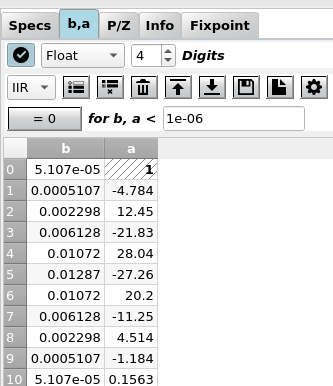
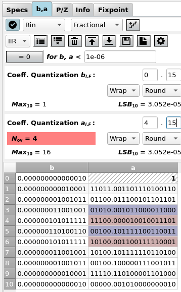

Input Coeffs
============

:numref:`fig_input_coeffs_float` shows a typical view of the **b,a** tab where
you can view and edit the filter coefficients. Coefficient values are updated
every time you design a new filter or update the poles / zeros.

.. _fig_input_coeffs_float:

   Screenshot of the coefficients tab for floating point coefficients

In the top row, the display of the coefficients can be disabled as a coefficient
update can be time consuming for high order filters (:math:`N > 100`).

Quantization format
-------------------

By default, coefficients are displayed in float quantization format, the format returned
by the filter design algorithm, with a selectable number of decimal places. Internally,
full precision is always used.

However, many hardware platforms with limited computing resources like uCs can only
perform fixpoint arithmetics. Here, scaling and wordlength have a strong influence on
the obtainable accuracy.

It is important to understand that the quantization format only influences the *display*
of the coefficients, the frequency response etc. is only updated when the quantize
icon (the staircase) is clicked. Only when you do a *fixpoint simulation*
or generate Verilog code from the fixpoint tab, the selected word format is
used for the coefficients.

Fixpoint
---------
When the format is set to fractional or integer, the fixpoint options are displayed as in
:numref:`fig_input_coeffs_fixpoint`. Here, the format `Binary` has been set.

.. _fig_input_coeffs_fixpoint:

   Screenshot of the coefficients tab for fixpoint formats (binary display)

Fixpoint Formats
~~~~~~~~~~~~~~~~

Any other format (Binary,
Hex, Decimal, CSD) is a fixpoint format with a fixed number of binary places
which activates further display options. These formats (except for CSD)
are based on the integer value i.e. by simply interpreting the bits as an
integer value ``INT`` with the MSB as the sign bit.

The scale between floating ("Real World Value", RWV) and fixpoint format 
is determined by partitioning
the word length ``W`` into integer and fractional places ``WI`` and ``WF``
with total word length ``W = WI + WF + 1`` where the "``+ 1``" accounts for
the sign bit.

Three kinds of partioning can be selected in a combo box:

    - The **integer format** has no fractional bits, ``WF = 0`` and
        ``W = WI + 1``. This is the format used by amaranth as well, ``RWV = INT``

    - The **normalized fractional format** has no integer bits, ``WI = 0`` and
        ``W = WF + 1``.

    - The **general fractional** format has an arbitrary number of fractional
        and integer bits, ``W = WI + WF + 1``.

In any case, scaling is determined by the number of fractional bits:

.. math::

    RWV = INT \cdot 2^{-WF}

In addition to setting the position of the binary point you can select the
behaviour for:

    - **Quantization:** The very high precision of the floating point format
        needs to be reduced for the fixpoint representation. Here you can select
        between ``floor`` (truncate the LSBs), ``round`` (classical rounding) and
        ``fix`` (always round to the next smallest magnitude value)

    - **Saturation:** When the floating point number is outside the range of
        the fixpoint format, either two's complement overflow occurs (``wrap``)
        or the value is clipped to the maximum resp. minimum ("saturation", ``sat``)

More info on fixpoint arithmetics can be found under :ref:`man_fixpoint_arithmetics`.

Development
-----------

More info on this widget can be found under :ref:`dev_input_coeffs`.

