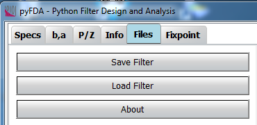
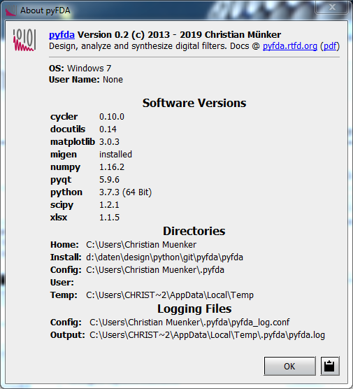

Input Files
============

:numref:`fig_input_files` shows a typical view of the **Files** tab where 
filter designs can be saved and loaded.

.. _fig_input_files:

   Screenshot of the files tab

Additionally, you can view the python version, paths etc. in the **About** popup window:

.. _fig_input_files_about:

   Screenshot of the "About pyfda" popup window
   
Development
-----------

More info on this widget can be found under :ref:`dev_input_files`.

