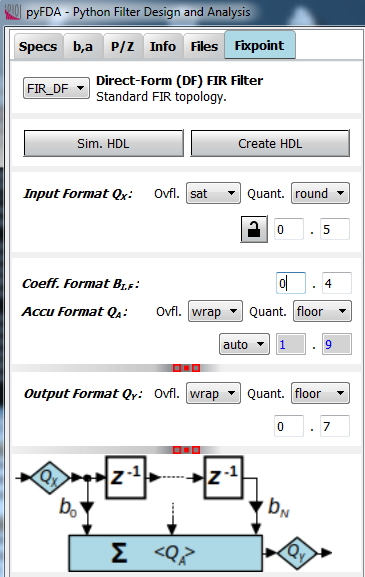

.. _man_fixpoint_specs:

###############
Fixpoint Specs
###############

Overview
---------

The **Fixpoint** tab (:numref:`fig_input_fixpoint`) provides options for 
generating and simulating discrete-time filters that 
can be implemented in hardware. Hardware implementations for discrete-time filters 
usually imply fixpoint arithmetics but this could change in the future as floating point
arithmetics can be implemented on FPGAs using dedicated floating point units (FPUs).

Order and the coefficients have been
calculated by a filter design algorithm from the `pyfda.filter_widgets` package to meet
target filter specifications (usually in the frequency domain).

In this tab, a fixpoint implementation can be selected in the upper left corner
(fixpoint filter implementations
are available only for a few filter design algorithms at the moment, most notably
IIR filters are missing). 

The fixpoint format of input word :math:`Q_X` and output word
:math:`Q_Y` can be adjusted for all fixpoint filters, pressing the "lock" button
makes the format of input and output word identical. Depending on the fixpoint
filter, other formats (coefficients, accumulator) can be set as well.

In general, **Ovfl.** combo boxes determine overflow behaviour (Two's complement
wrap around or saturation), **Quant.** combo boxes select quantization behaviour
between rounding, truncation ("floor") or round-towards-zero ("fix"). These methods
may not all be implemented for each fixpoint filter. Truncation is easiest to
implement but has an average bias of -1/2 LSB, in contrast, rounding has no bias
but requires an additional adder. Only rounding-towards-zero guarantees that the
magnitude of the rounded number is not larger than the input, thus preventing
limit cycles in recursive filters.

See also [Yates_2020]_ and [Lyons]_

.. _fig_input_fixpoint:

   
   Fixpoint parameter entry widget (overflow = wrap)

Typical simulation results are shown in :numref:`fig_pyfda_screenshot_hn_fix_t`
(time domain) and :numref:`fig_pyfda_screenshot_hn_fix_f` (frequency domain).

.. _fig_pyfda_screenshot_hn_fix_t:

.. figure:: ../screenshots/pyfda_screenshot_fix_yn_t.png
   :alt: Screenshot of fixpoint simulation results (time domain)
   :width: 100%
   :align: center
   
   Fixpoint simulation results (time domain)

Fixpoint filters are inherently non-linear due to quantization and saturation effects,
that's why frequency characteristics can only be derived by running a transient
simulation and calculating the Fourier response afterwards:
   
.. _fig_pyfda_screenshot_hn_fix_f:

.. figure:: ../screenshots/pyfda_screenshot_fix_yn_f.png
   :alt: Screenshot of fixpoint simulation results (frequency domain)
   :width: 100%
   :align: center

   Fixpoint simulation results (frequency domain)

The following shows an example of a coefficient in Q2.4 and Q0.3 format
using wrap-around and truncation. It's easy to see that for simple wrap-around
logic, the sign of the result may change.

::

  S | WI1 | WI0 . WF0 | WF1 | WF2 | WF3  :  WI = 2, WF = 4, W = 7
  0 |  1  |  0  .  1  |  0  |  1  |  1   =  43 (INT) or 43/16 = 2 + 11/16 (RWV)
                .
          |  S  . WF0 | WF1 | WF2        :  WI = 0, WF = 3, W = 4
             0  .  1  |  0  |  1         =  5 (INT) or 5/8 (RWV)

Summation
*********

Before adding two fixpoint numbers with a different number of integer and/or
fractional bits, integer and fractional word lenghts need to equalized:

- the fractional parts are padded with zeros
- the integer parts need to be sign extended, i.e. with zeros for positive
  numbers and with ones for negative numbers
- adding numbers can require additional integer places due to word growth

For this reason, the position of the binary point needs to be

::

  S | WI1 | WI0 . WF0 | WF1 | WF2 | WF3  :  WI = 2, WF = 4, W = 7
  0 |  1  |  0  .  1  |  0  |  1  |  1   =  43 (INT) or 43/16 = 2 + 11/16 (RWV)

                +

  S | WI1 | WI0 . WF0 | WF1 | WF2 | WF3  :  WI = 2, WF = 4, W = 7
  0 |  0  |  0  .  1  |  0  |  1  |  0   =  10 (INT) or 10/16 (RWV)

  ===================================================================

  S | WI1 | WI0 . WF0 | WF1 | WF2 | WF3  :  WI = 2, WF = 4, W = 7
  0 |  1  |  1  .  0  |  1  |  0  |  1   =  53 (INT) or 53/16 = 3 + 5/16 (RWV)

More info on fixpoint numbers and arithmetics can be found under
:ref:`man_fixpoint_arithmetics`.

Configuration
-------------

The configuration file ``pyfda.conf`` lists the fixpoint classes to be used, 
e.g. ``DF1`` and ``DF2``. :class:`pyfda.libs.tree_builder.Tree_Builder` parses this file 
and writes all fixpoint modules 
into the list ``fb.fixpoint_widgets_list``. The input widget 
:class:`pyfda.input_widgets.input_fixpoint_specs.Input_Fixpoint_Specs` constructs a combo box from this list 
with references to all successfully imported fixpoint modules. 
The currently selected fixpoint widget (e.g. ``DF1``) is imported from 
:mod:`pyfda.fixpoint_widgets` together with the referenced image.

Development
------------

More info on this widget can be found under :ref:`dev_input_fixpoint_specs`.

