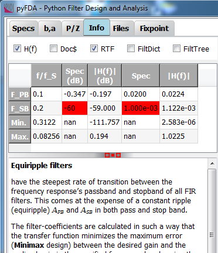

Input Info
============

:numref:`fig_input_info` shows a typical view of the **Info** tab where
information on the current filter design and design algorithm is displayed.

.. _fig_input_info:

   Screenshot of the info tab

In the top row, buttons select which information is displayed.

The **H(f)** button activates the display of specifications in the frequency domain and
how well they are met. Failed specifications are highlighted in red.

The **About** button opens a pop-up window with general infos about the software,
licensing and module versions (:numref:`fig_input_info_about`).

.. _fig_input_info_about:

.. figure:: ../img/manual/pyfda_input_info_about.png
   :alt: Screenshot of the About pop-up window
   :align: center
   :width: 50%

   Screenshot of the "About" pop-up window

The **Debug** button enables some debugging options:
- **Doc$**: Show docstring info from the corresponding python (usually scipy) module.
- **RTF**: Use Rich Text Format for documentation.
- **FiltDict**: Display the dictionary containing all current settings of the software.
  This dictionary is saved and restored when saving / loading a filter.
- **FiltTree**: Display the hierarchical tree with all filter widgets that have been
  detected during the start of the software

Development
-----------

More info on this widget can be found under :ref:`dev_input_info`.

