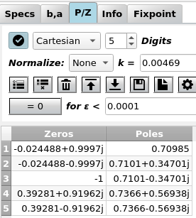

Input P/Z
==========

:numref:`fig_input_pz_cartesian` shows a typical view of the **P/Z** tab where
you can view and edit the filter poles and zeros. Pole / zero values are updated
every time you design a new filter. After editing poles or zeros by hand, the changes
have to be applied via the (highlighted) button "Apply P/Z to filter".

In real-valued systems (i.e. systems with a real-valued impulse response and real-valued
coefficients) poles and zeros are real-valued or come in conjugate complex pairs. This
means they have the same real part and positive / negative imaginary part,  e.g. 
:math:`p_1 = 0.5 + 0.5j` and :math:`p_2 = 0.5 - 0.5j` or
:math:`z_1 = 1\angle +0.25 \pi` and :math:`z_2 = 1\angle - 0.25 \pi`. Otherwise, you
end up with a complex-valued system with complex-valued coefficients which is not what
you want in most cases.

Cartesian format
-----------------

.. _fig_input_pz_cartesian:

   Screenshot of the pole/zero tab in cartesian format

Poles and zeros are displayed and can be edited in cartesian format (:math:`x` and `y`) by default as shown
in :numref:`fig_input_pz_cartesian`.

Polar format
--------------

.. _fig_input_pz_polar:

.. figure:: ../img/manual/pyfda_input_pz_polar.png
   :alt: Screenshot of the pole/zero tab in polar format with activated "Format" button
   :align: center
   :width: 50%

   Screenshot of the pole/zero tab in polar format with activated "Format" button

Alternatively, poles and zeros can be displayed and edited in polar format
(radius and angle) as shown in :numref:`fig_input_pz_polar`. Especially for zeros
which often are placed on the unit circle (:math:`r = 1`) this format may be more
suitable.

During editing, use the '>' character to separate radius and phase. The phase can
be displayed and entered in the following formats:

- **Degrees** with a range of :math:`\pm -180° \ldots +180°`, terminate the phase
  with an 'o' or '°' to indicate degrees.
- **Rad** with a range of :math:`\pm -\pi \ldots +\pi`, simply enter the value or terminate
  the phase with an 'r' or with 'rad' to indicate rads.
- Multiples of **pi** with a range of :math:`\pm -1 \ldots +1`, terminate the phase with
  a 'p' or 'pi' to specifiy multiples of pi.

When entering poles or zeros, the format is chosen automatically, depending on which 
special characters (like '<', 'o', 'r' or 'pi') have been found in the text field.

You can "misuse" this feature as a converter between different number formats:

- '3<0.7854' or '3<0.7854r' or '3<0.7854rad'
- '3<0.25p' or '3<0.25pi'
- '3<45°' or '3<45o'
-  2.12132+2.12132j

all represent the same value. You can omit the radius if :math:`r = 1`, simply 
enter '<45°' instead of '1<45°'.

Use the corresponding icons to enter a new row or delete one. The trash can deletes the whole
table.

Saving and Loading
~~~~~~~~~~~~~~~~~~~

Poles and zeros can be saved in various file formats (CSV, MAT, NPZ, NPY). CSV file
format options (row or column, delimiter, ...) are selected in the CSV pop-up menu 
(the 'cog' icon). Independent of the table display format, coefficients are saved
with full precision in complex (cartesian) number format when the format button 
(the "star") is deactivated.

When the format button *is* activated, values are saved *exactly as displayed*. 
This means, cells may be saved with reduced number 
of digits and in polar number format, containing special characters like '<'.

Development
-----------

More info on this widget can be found under :ref:`dev_input_pz`.

