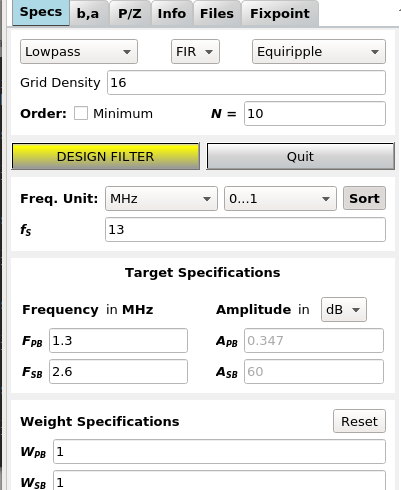
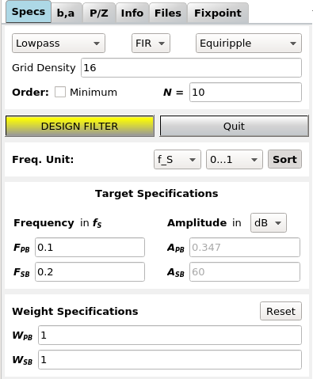
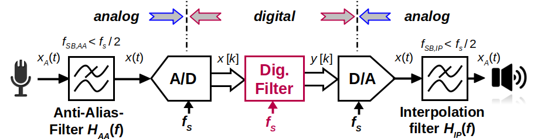
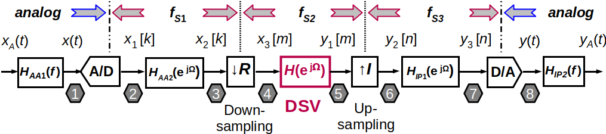

Input Specs
===========

Introduction
-------------

:numref:`fig_specs_input_window` shows a typical view of the **Specs** tab.

"Load" and "Save" ... well, loads and saves complete filter designs. Coefficients and 
poles / zeros can be imported and exported in the "b,a" resp. the "P/Z" tab.

For the actual filter design, you can specify the kind of filter to be designed and its 
specifications in the frequency domain:

- **Response type** (low pass, band pass, ...)

- **Filter type** (IIR for a recursive filter with infinite impulse response or 
  FIR for a non-recursive filter with finite impulse response)
    
- **Filter class** (elliptic, ...) allowing you to select the filter design algorithm

.. _fig_specs_input_window:

   Screenshot of specs input window

Not all combinations of design algorithms and response types are available - you
won't be offered unavailable combinations and some fields may be greyed out.

A nice description of the design of FIR filters (also with pyfda) can be found at 
[Designing Generic FIR Filters with pyFDA and NumPy]
(https://tomverbeure.github.io/2020/10/11/Designing-Generic-FIR-Filters-with-pyFDA-and-Numpy.html)

Order
------
The **order** of the filter, i.e. the number of poles / zeros / delays is
either specified manually or the minimum order can be estimated for many filter
algorithms to fulfill a set of given specifications.

Frequency Unit
---------------
In DSP, specifications and frequencies are expressed in different ways:

.. math::

    F = \frac{f}{f_S}  \textrm{ or }\Omega = \frac{2\pi f}{f_S} = 2\pi F

In pyfda, you can enter parameters as absolute frequency :math:`{{f}}`, as
normalized frequency :math:`{{F}}` w.r.t. to  the :ref:`sampling_frequency` 
:math:`{f_S}` or to the :ref:`Nyquist Frequency<nyquist_frequency>` 
:math:`f_{Ny} = f_S / 2` (:numref:`fig_specs_input_window_norm`):

.. _fig_specs_input_window_norm:

   
   Displaying normalized frequencies

Amplitude Unit
--------------
Amplitude specification can be entered as V, dB or W; they are converted 
automatically. Conversion depends on the filter type (IIR vs. FIR) and whether
pass or stop band are specified. For details see the conversion functions
:func:`pyfda.libs.pyfda_lib.unit2lin` and :func:`pyfda.libs.pyfda_lib.lin2unit`.

Background Info
---------------

.. _sampling_frequency:

Sampling Frequency
~~~~~~~~~~~~~~~~~~~
One of the most important parameters in a digital signal processing system is 
the **sampling frequency** :math:`{\pmb{f_S}}`, defining the clock frequency with which 
the registers (flip-flops) in the system are updated. In a simple DSP system,
the clock frequency of ADC, digital filter and DAC might be identical:

   
   A simple signal processing system

Sometimes it makes sense to change the sampling frequency in the processing system
e.g. to reduce the sampling rate of an oversampling ADC or to increase the 
clocking frequency of an DAC to ease and improve reconstruction of the analog
signal.

   A signal processing system with multiple sampling frequencies
   

Aliasing and Nyquist Frequency
~~~~~~~~~~~~~~~~~~~~~~~~~~~~~~

When the sampling frequency is too low, significant information is lost in the 
process and the signal cannot be reconstructed without errors (forth image in :numref:`fig_aliasing`)
[Smith99]_. This effect is called *aliasing*.

.. _fig_aliasing:

.. figure:: ../img/manual/aliasing.png
   :alt: Sampling and aliasing with 4 different sinusoids
   :align: center

   Sampling with :math:`f_S = 1000` Hz of sinusoids with 4 different frequencies

.. _nyquist_frequency:   

When sampling with :math:`f_S`, the maximum signal bandwidth :math:`B` that can
represented and reconstructed without errors is given by :math:`B < f_S/2 = f_{Ny}`. This 
is also called the *Nyquist frequency* or *bandwidth* :math:`f_{Ny}`. 
Some filter design tools and algorithms normalize frequencies w.r.t. to  :math:`f_{Ny}`
instead of :math:`f_S`.

Half-Band Filters
-----------------

Explanation of half-band filters and how to design them with pyfda can be found at 
[Half-Band Filters, a Workhorse of Decimation Filters]
(https://tomverbeure.github.io/2020/12/15/Half-Band-Filters-A-Workhorse-of-Decimation-Filters.html#designing-a-half-band-fir-filter-with-pyfda)

   
Development
-----------

More info on this widget can be found under :ref:`dev_input_specs`.

