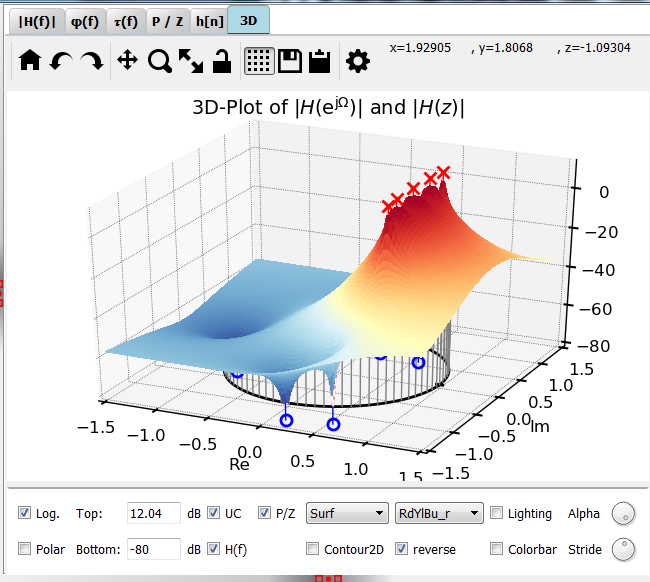
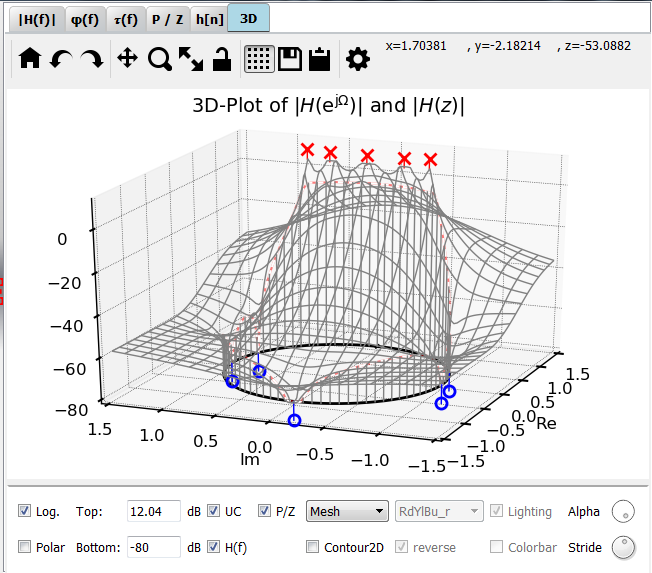

Plot 3D
============

:numref:`fig_plot_3d` shows a typical view of the **3D** tab for 3D visualizations
of the magnitude frequency response and poles / zeros. :numref:`fig_plot_3d` is a
surface plot which takes the longest time to compute.

.. _fig_plot_3d:

   Screenshot of the 3D tab (surface plot)

You can plot 3D visualizations of :math:`\abs{H(z)}` as well as :math:`\abs{H(e^{j\omega})}`
along the unit circle (UC) magnitude.

For faster visualizations, start with a mesh plot (:numref:`fig_plot_3d_mesh`)
or a contour plot
and switch to a surface plot when you are pleased with scale and view.

.. _fig_plot_3d_mesh:

   Screenshot of the 3D tab (mesh plot)

   
Development
-----------

More info on this widget can be found under :ref:`dev_plot_3d`.

