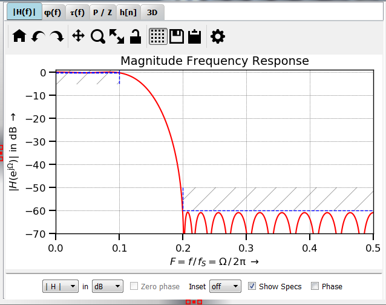

Plot H(f)
============

:numref:`fig_plot_hf` shows a typical view of the **|H(f)|** tab for plotting the
magnitude frequency response.

.. _fig_plot_hf:

   Screenshot of the `|H(f)|` tab

You can plot magnitude, real or imaginary part in V (linear), W (squared) or dB
(log. scale).

**Zero phase** removes the linear phase as calculated from the filter order. 
There is no check whether the design actually is linear phase, that's why results
may be nonsensical. When the unit is dB or W , this option makes no sense and is
not available. It also makes no sense when the magnitude of H(f) is plotted, but 
it might be interesting to look at the resulting phase.

Depending on the **Inset** combo box, a small inset plot of the frequency reponse
is displayed, changes of zoom, unit etc. only have an influence on the main plot
("fixed") or the inset plot ("edit"). This way, you can e.g. zoom into pass band
and stop band in the same plot. The handling still has some rough edges.

**Show specs** displays the specifications; the display makes little sense when
re(H) or im(H) is plotted.

**Phase** overlays a plot of the phase, the unit can be set in the phase tab.

   
Development
-----------

More info on this widget can be found under :ref:`dev_plot_hf`.

