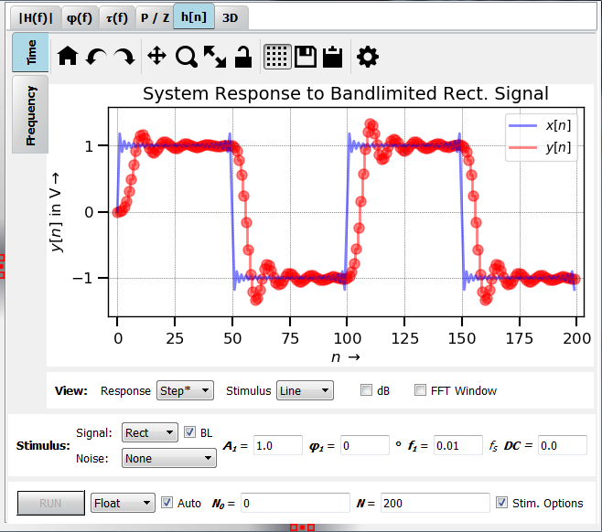
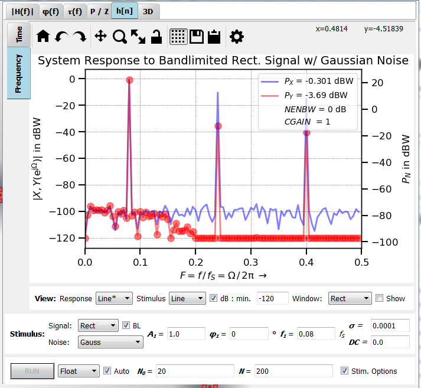

Plot y[n]
=========

:numref:`fig_plot_impz` shows a typical view of the **y[n]** tab for plotting
the transient response and its Fourier transformation, here, for a Chebychev filter (IIR).

.. _fig_plot_impz:

   Screenshot of the y[n] tab (time domain)
   
This tab is split into several subwindows:

Time / Frequency (main plotting area)
-------------------------------------
These vertical tabs select between the time (transient) and frequency (spectral)
domain. Signals are calculated in the time domain and then transformed using 
Fourier transform.

Time
~~~~

Frequency
~~~~~~~~~
The Fourier transform of the transient signal can be viewed in the vertical tab
"Frequency" (:numref:`fig_plot_impz_f`). This is especially important for fixpoint
simulations where the frequency response cannot be calculated analytically.

.. _fig_plot_impz_f:

   Screenshot of the y[n] tab (frequency domain)

For an transform of periodic signals without leakage effect, ("smeared" spectral lines) take care that:
    
- The filter has settled sufficiently. Select a suitable value of **N0**.

- Choose the number of data points **N** in such a way that an integer
  number of periods is displayed (and transformed).

- The FFT window is set to rectangular. Other windows
  work as well but they distribute spectral lines over several bins. When it
  is not possible to capture an integer number of periods, use another window
  as the rectangular window has the worst leakage effect.
      
Plots
-----
What will be plotted and how. 
    
Stim.
-----
Select the stimulus, its frequency, DC-content, noise ... When the BL checkbox
is checked, the signal is bandlimited to the Nyquist frequency. Some signals
have strong harmonic content which produces aliasing. This can be seen best
in the frequency domain (e.g. for a sawtooth signal with f = 0.15).

DC and Different sorts of noise can be added.

Run
---
Usually, plots are updated as soon as an option has been changed. This can 
be disabled with the **Auto** checkbox for cases where the simulation takes
a long time (e.g. for some fixpoint simulations).

   
Development
-----------

More info on this widget can be found under :ref:`dev_plot_impz`.
