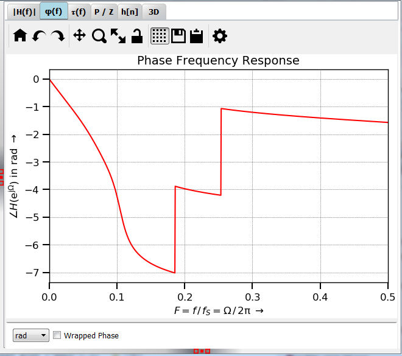

Plot Phi(f)
============

:numref:`fig_plot_phi` shows a typical view of the :math:`\pmb{\varphi(f)}` tab for plotting the
phase response of an elliptical filter (IIR).

.. _fig_plot_phi:

   Screenshot of the :math:`\varphi(f)` tab

You can select the unit for the phase and whether the phase will be wrapped 
between :math:`-\pi \ldots \pi` or not.

   
Development
-----------

More info on this widget can be found under :ref:`dev_plot_phi`.
