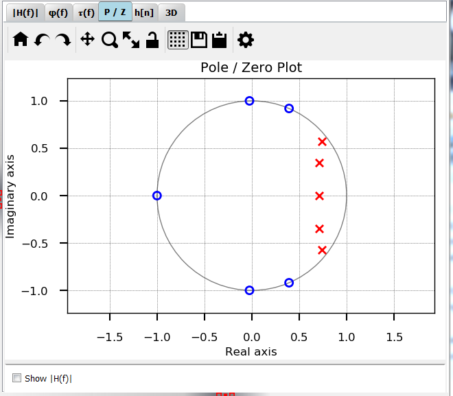
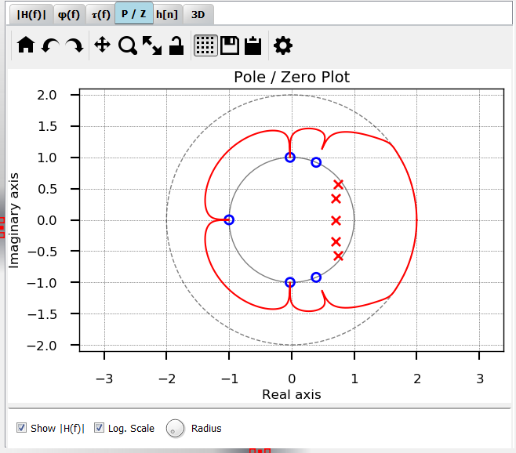

Plot P/Z
=========

:numref:`fig_plot_pz` shows a typical view of the **P/Z** tab for plotting
poles and zeros, here, an elliptical filter (IIR) is shown.

.. _fig_plot_pz:

   Screenshot of the plot P/Z tab

Optionally, the magnitude frequency response can be plotted around the unit circle
to show the influence of poles and zeros (:numref:`fig_plot_pz_hf`).

.. _fig_plot_pz_hf:

   Screenshot of the plot P/Z tab with overlayed H(f) plot

   
Development
-----------

More info on this widget can be found under :ref:`dev_plot_pz`.
