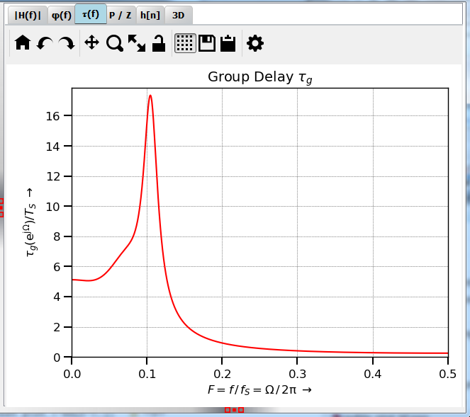

Plot tau(f)
=======================

:numref:`fig_plot_tau_g` shows a typical view of the :math:`\pmb{\tau(f)}` tab for plotting the
group delay, here, an elliptical filter (IIR) is shown.

.. _fig_plot_tau_g:

   Screenshot of the :math:`\tau(f)` tab

There are no user servicable parts on this tab. 

The algorithm for calculating the group delay is explained in detail in 
 :func:`pyfda.libs.pyfda_sig_lib.group_delay`.
 
Show :func:`group_delay`

   
Development
-----------

More info on this widget can be found under :ref:`dev_plot_tau_g`.
